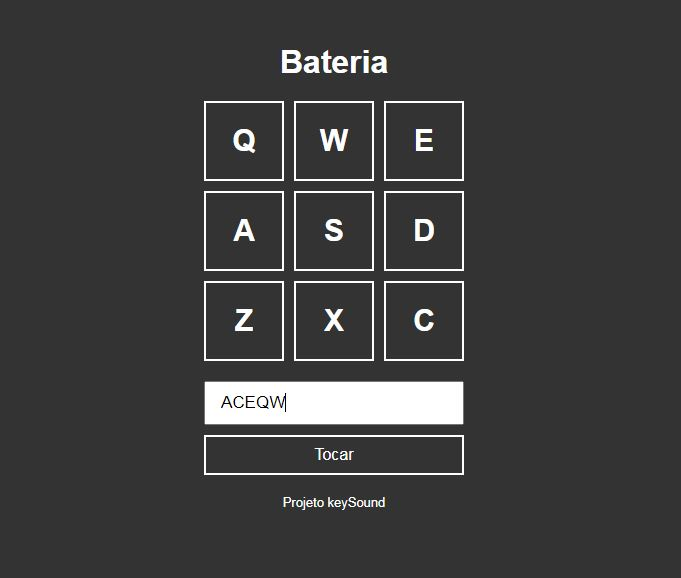

## 🔖&nbsp; Sobre

**keySound** é um repósitorio que tem como objetivo desenvolver habilidades fundamentais para quem está começando rumo a programação Javascript. Nesse projeto,
o usúario ouve sons conforme digita as teclas, podendo armazenar batidas para reproduzi-las em sequência posteriormente.

## 🚀 Tecnologias utilizadas

O projeto foi desenvolvido utilizando as seguintes tecnologias

- HTML 
- CSS
- JAVASCRIPT

